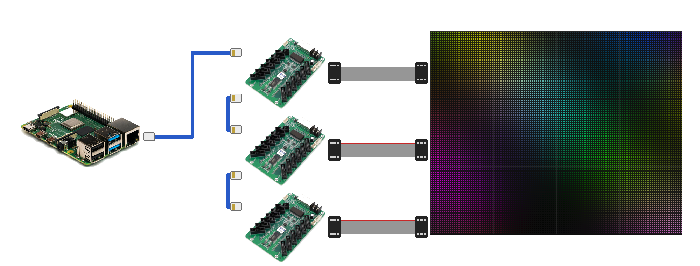

# e120



Drive a Colorlight E120 LED receiving card and its modules over raw Ethernet: generate and flash the module configuration yourself, then put images, video and live streams on the panel.

**Drive receiving cards without a sender card and without vendor software.** `e120` discovers the card, backs up and installs firmware, generates and flashes the configuration from a text file, sets the card's place in a wall, and streams to it. Useful for cards and panels the vendor supports badly or not at all.

The card speaks a layer-2 protocol with fixed MAC addresses and no IP, so `e120` writes whole Ethernet frames itself (BPF on macOS, a packet socket on Linux) and needs no vendor software. It reads and writes the card's flash and EEPROM, with address allowlists that keep configuration writes inside the parameter block and firmware writes on the card's own staging path. It installs FPGA firmware. It generates the receiver configuration (the `.rcvbp` file and the 64 KB boot image the card loads at power-on) from a short TOML panel spec plus a chip library, and ships libraries for common driver chips and module classes mined from 2,381 vendor config files. It shows still images, plays video through ffmpeg, reads raw rgb24 frames from stdin, and serves a unix socket other programs can write frames to. Every command that writes flash or EEPROM prints its plan and stops unless `--commit` is given.

## Motivation

Colorlight's own software is the only official way to drive its receiving cards, and LEDVISION dropped the ability to send content to a receiving card directly: a sender card or box is required, and the software itself is a large Windows install. `e120` works with zero Colorlight software. A Mac or Linux machine with an Ethernet port talks to the card directly, provisions it from a text file, and plays whatever ffmpeg can decode.

## Project status

Tested only on the hardware listed under [Tested](#tested), one card and one module. Other cards and firmware builds may behave differently, and a firmware or flash write to an untested card can leave it unbootable: take `e120 flash snapshot` first and keep the result. If you run this on other hardware, whatever the outcome, open a pull request or an issue with the card model, the module, and what you saw.

## Install

Rust stable via [rustup](https://rustup.rs) (`rust-toolchain.toml` pins the channel), then:

```sh
cargo install --path crates/e120-cli
```

`e120 show video` and `e120 show stream` pipelines need `ffmpeg` on the PATH (`brew install ffmpeg`).

Raw Ethernet needs privileges. On macOS the BPF devices must be readable and writable; without that `e120` fails with `could not open any /dev/bpf* device ... (try: sudo chmod o+rw /dev/bpf*)`:

```sh
sudo chmod o+rw /dev/bpf*    # resets on reboot
```

On Linux the binary needs the raw-socket capabilities (`CAP_NET_ADMIN` because the socket is put in promiscuous mode to see the card's replies), or root; redo after every `cargo install`:

```sh
sudo setcap cap_net_raw,cap_net_admin+ep "$(command -v e120)"
```

The card is connected directly to one interface; the default is `en24`, pass `--iface` for another (`eth0`, `enp3s0` and the like on Linux; the link must be up but needs no address). `scripts/mirror.sh` uses `x11grab` on Linux and does not work under Wayland.

## Usage

```
Drive a Colorlight receiving card over raw Ethernet

Usage: e120 [OPTIONS] <COMMAND>

Commands:
  discover    Send a discovery packet and print any card that answers
  brightness  Set panel brightness (0-255)
  provision   Bring a card to a working state: snapshot, firmware, config, EEPROM, verify
  show        Put pixels on the panel: images, video, streams, patterns
  config      Generate, inspect and transfer .rcvbp configurations
  flash       Read and write the card's flash, and snapshot or restore it
  firmware    Install FPGA firmware
  card        Card state held in RAM or EEPROM: layout, screen size, test modes
  debug       Wire diagnostics: listen, hand-built frames, pcap tools
  help        Print this message or the help of the given subcommand(s)

Options:
  -h, --help                     Print help
  -i, --iface <IFACE>            Network interface directly connected to the receiving card [default: en24]
      --width <WIDTH>            Panel width in pixels [default: 128]
      --height <HEIGHT>          Panel height in pixels [default: 64]
      --order <ORDER>            Color order on the wire [default: bgr]
  -b, --brightness <BRIGHTNESS>  Brightness 0-255 (sent in sync frames) [default: 255]
```

Find the card; the reply includes its firmware version:

```sh
e120 discover
```

Provision a card from a panel spec and a firmware image. Without `--commit` it prints the five steps (snapshot, firmware, EEPROM read, config, EEPROM write) and does nothing. Power-cycle the card afterwards; it configures itself from flash.

```sh
e120 provision --spec config/panels/p25-128x64-sm16269s.toml \
    --firmware third-party/firmware/E320_PWM_FPGA16.53_20231227_SM16386S_SM16269SH.hex \
    --position 0,0 --commit
```

Show an image, scaled to the panel, and keep refreshing until Ctrl-C:

```sh
e120 show image picture.png --hold
```

Play a video in a loop at 30 fps, fitted inside the panel:

```sh
e120 show video clip.mp4 --loop --fps 30 --fit contain
```

Pipe frames from ffmpeg. `show stream` reads bare rgb24 frames of `--size` from stdin; a size other than the panel's is resampled with `--fit`:

```sh
ffmpeg -i clip.mp4 -vf scale=128:64 -f rawvideo -pix_fmt rgb24 - \
    | e120 show stream --size 128x64 --fps 30

ffmpeg -f avfoundation -pixel_format bgr0 -framerate 30 -i "Capture screen 0" \
    -vf scale=128x64:flags=area -fps_mode cfr -r 30 -f rawvideo -pix_fmt rgb24 - \
    | e120 show stream --size 128x64 --fps 30
```

`scripts/mirror.sh` is the second pipeline as a script: `scripts/mirror.sh -s 128x64 -f 30 -c 0,0,640,320` mirrors a crop of the screen.

Serve a unix socket. One client at a time connects, sends a 12-byte header, then rgb24 frames, and is paced at the header's fps; the panel keeps the last frame between clients. The header is `E120`, version byte `1`, one reserved byte, then width, height and fps as little-endian u16 (`crates/e120-video/src/raw.rs`).

```sh
e120 show serve --socket /tmp/e120.sock
```

```python
import socket, struct
s = socket.socket(socket.AF_UNIX); s.connect("/tmp/e120.sock")
s.sendall(struct.pack("<4sBBHHH", b"E120", 1, 0, 128, 64, 30) + bytes(128 * 64 * 3))  # header, then one black frame
```

Other things the panel can show:

```sh
e120 show fill ff8000 --hold        # solid colour
e120 show test rgb --hold           # gradient | rows | border | rgb | white
e120 show blank
e120 brightness 40
```

Configuration without a full provision:

```sh
e120 config gen --spec config/panels/p25-128x64-sm16269s.toml --out-dir build
e120 config info build/p25-128x64-sm16269s.rcvbp
e120 config read --out card.rcvbp                  # what the card holds
e120 config diff card.rcvbp build/p25-128x64-sm16269s.rcvbp
e120 config send --spec config/panels/p25-128x64-sm16269s.toml   # RAM only, no flash
```

Flash and firmware. Reads are always safe; writes need `--commit`:

```sh
e120 flash snapshot --dir before                   # primary bank + golden bank
e120 firmware install image.hex --commit
e120 flash restore --dir before --commit           # configuration back, not firmware
```

Multi-panel walls: provision each card with its own `--position x,y`, put the same `x,y` on that card's receiver entry in a layout file (`e120 card layout-example` prints a two-card one; panels are placed inside their receiver) and stream it with `e120 show video --layout wall.json`. Every card hears the whole screen and keeps its own window of it.

## Tested

✅ driven on the bench · ⚠️ configuration generates, never driven · ❌ not supported

| panel (driver chip) | Colorlight E120 | other Colorlight E-series | Linsn · Novastar · Huidu |
|---|:---:|:---:|:---:|
| P2.5 128x64 1/16, SM16269S | ✅ | ⚠️ | ❌ |
| ICN2053 · ICN2055 · ICN2065 | ⚠️ | ⚠️ | ❌ |
| ICN2038S · ICND2163 | ⚠️ | ⚠️ | ❌ |
| MBI5124 · MBI5124N · MBI5153 | ⚠️ | ⚠️ | ❌ |
| SM16380 · SM16389 · SM16259 · SM16237DS · SM16169S | ⚠️ | ⚠️ | ❌ |
| LS9929 · LS9929C · LS9930 · LS9935B · LS9936 | ⚠️ | ⚠️ | ❌ |
| MY9862 · MY9868 · DP5525 | ⚠️ | ⚠️ | ❌ |
| SM16369S · ICND2263 (register record not decoded) | ❌ | ❌ | ❌ |
| snake-wired outdoor modules (1/2, 1/4, 1/5, 1/10 scan) | ❌ | ❌ | ❌ |

The ⚠️ rows are the 87 module classes in `config/panels/mined/`; other E-series cards are ⚠️ because the 16.53 firmware image is itself named E320 and the protocol is shared, but none has been tried. Host: macOS ✅, Linux ⚠️ (builds and lints for x86_64 and aarch64, not run against a card).

## Configuration

A panel is one TOML file in `config/panels/`. `e120 config gen` turns it into the `.rcvbp`, the boot image, and a text file saying where each byte came from. The bench panel's spec, shortened:

```toml
name = "p25-128x64-sm16269s"

[module]
gray_bits = 12
width = 128
height = 64
scan = 16
line_dir = 0
data_groups = 1
serial_clock = 8

[screen]
width = 128
height = 64

[chip]
library = "config/chips/sm16269s-factory.toml"

[color]
swap = 3
source = [2, 1, 0]

[current]
gains = [43, 43, 43, 43]
percent = [0.1, 0.1, 0.1]

[timing]
gamma = 2.8
refresh_hz = 60.0
gclock = 0x14
min_oe = 0.0001
luminance_level = 188
oe_8ns = true

[mapping]
reversed_groups = true
reversed_lines = false
block = 64

[boot]
arm_at_boot = true

[record01_overrides]
"0x02F" = 0x01
```

- `[module]` the module: size, scan (1/16 here), line direction, data groups, grey depth, serial clock.
- `[screen]` the whole screen this card drives.
- `[chip]` the driver-chip library file: chip ids, the 20-byte chip-control block, the register table.
- `[color]` channel swap and the R/G/B source order.
- `[current]` per-channel current gains and percentages.
- `[timing]` gamma, refresh rate, GCLK, minimum OE, luminance level, 8 ns OE.
- `[mapping]` the wiring: group and line reversal, and the column block after which the row halves alternate along the shift chain.
- `[boot]` whether the card arms the drivers from flash at power-on.
- `[record01_overrides]` individual record 0x01 bytes applied last.

Chip libraries are in `config/chips/`, panel specs in `config/panels/`. `config/chips/mined/` (21 chip families) and `config/panels/mined/` (87 module classes) were generated by `scripts/corpus-mine.py` from the vendor config corpus; each file's header states how many files agreed. Only the P2.5 128x64 SM16269S module on firmware 16.53, with `config/panels/p25-128x64-sm16269s.toml`, has been driven on a bench. Everything mined is a vendor default, not a measurement; use it as a starting point and check it against a vendor file for the exact module when one exists.

How the generator derives each record, and its limits, is in [docs/building-a-config.md](docs/building-a-config.md).

## How it was worked out

[docs/README.md](docs/README.md) indexes the notes: the `.rcvbp` container and record 0x01 byte by byte, the boot image region by region, the pixel map, the chip-control block, the EEPROM records, the pixel protocol recovered from the vendor sender DLL, the FPGA bitstream and flash layout, and the firmware 16.53 install. `crates/e120-rcvbp/tests/factory.rs` pins the generator to the card: the factory basic pack and boot image regenerate byte for byte from the card's day-one flash dump (kept outside the repository; those tests skip without it). Bench results were taken with PSU current readings and averaged camera captures ([docs/bench.md](docs/bench.md)); the values that mattered and what each alternative did are in [docs/rendering.md](docs/rendering.md), and every claim that later measurement disproved is kept in [docs/retracted-findings.md](docs/retracted-findings.md).

## Hardware

Developed against one Colorlight E120 receiving card running firmware 16.53 (`E320_PWM_FPGA16.53_20231227_SM16386S_SM16269SH.hex`), one P2.5 128x64 SMD1415 module, 1/16 scan, with SM16269S driver chips, on macOS. Linux is supported through a packet socket and builds and lints for that target, but has not been run against the card.

## License

MIT, see [LICENSE](LICENSE). The Raspberry Pi photo in the header is from Wikimedia Commons, CC BY-SA 4.0.
