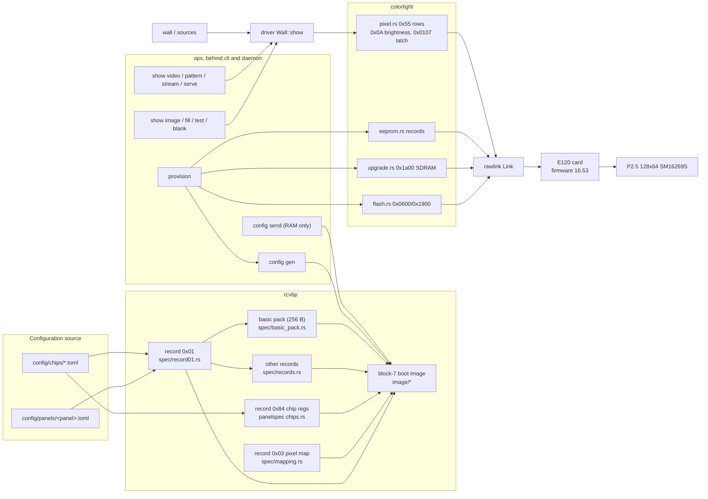

# Architecture

The path from a panel description to light, and which part of the repo owns
each step. The settings behind every value are in
[rendering.md](rendering.md) and the measurement method in
[bench.md](bench.md).

## The pipeline

Two things reach the card over one raw Ethernet link (`/dev/bpf` on macOS, an
`AF_PACKET` socket on Linux; the default interface is `en24`):

1. **Configuration**, once per card: a TOML panel spec is compiled into the
   receiver's boot image and written to flash block 7 together with firmware
   and the EEPROM control area (`rxp provision`). The card configures itself
   from flash at every power-on.
2. **Content**, every frame: brightness, 64 row packets, a gap, three latch
   frames (`rxp show image` / `rxp show video`).



### 1. Panel spec to boot image (`rcvbp`)

Input is `config/panels/<panel>.toml` (`panelspec::PanelSpec`) plus the
chip library it names (`config/chips/*.toml`, `panelspec::ChipLibrary`). The
region offsets of the boot image come from the card model
(`receivers`, `config/cards/<card>.toml`, `[memory.boot_image]`). No donor file is
read; every output byte is a vendor default, a spec field, a chip-library
value or a documented literal, and `Generated.sources` says where each
placement came from ([building-a-config.md](building-a-config.md)).

| output | built by | from |
|---|---|---|
| record 0x01 (764 B) | `spec/record01.rs` | vendor Reset defaults, spec fields, chip-control block, then chip-library overrides, then `[record01_overrides]` last, which is where `+0x02F = 1` lands (the `0x..` keys are parsed and range-checked when the TOML loads, `panelspec/src/chips.rs::record01_offsets`) |
| record 0x03 pixel map | `spec/mapping.rs` | geometry + `[mapping]`: `line = row % scan`, `slot = (col/blk)·(groups·blk) + group·blk + col%blk`, `blk = mapping.block` |
| record 0x84 chip registers | `panelspec` `ChipLibrary::record_84` | library register order, reg 0x02 = scan−1 |
| remaining records | `spec/records.rs` | decoded loader defaults, vendor order; 0x84 inserted before 0xcd |
| `.rcvbp` container | `lib.rs` | 32-byte header, zlib record stream, CRC-32 trailer ([rcvbp-format.md](rcvbp-format.md)) |
| basic pack (256 B) | `spec/basic_pack.rs` | vendor `GetBasicParam` from record 0x01 + spec, body CRC |
| block-7 image (64 KB) | `image/mod.rs::Block7Builder`, `finish()` → `Block7 { image, notes, changed_pages }` | region by region ([compiled-image-format.md](compiled-image-format.md)); the region offsets are the model's `BootImage`, which for the E120 equals the pinned `image::*_OFFSET` constants |

Block-7 regions, in the order the builder must place them (later placements
win overlapping pages):

```
zero_regions → basic_pack @0x0000 → data_swap @0x0500 → module_positions @0x0600
→ anti_void @0x1800 → void_line_columns @0x1400 (iff mapping.gate_phantom_positions)
→ mapping @0x3000 → scan_table @0x6000 → [chip_registers @0x0900 iff boot.arm_at_boot]
→ rcvbp @0x8000
```

`void_line_columns` must run after `zero_regions` (which clears 0x1000–0x1800);
it is what turns black into LEDs-off ([rendering.md](rendering.md)). The
shared sequence lives in `Block7Builder::from_generated`; `gen_config` adds
the chip page and the embedded `.rcvbp` on top, and `send_params` slices the
same image into the vendor's 34 real-time RAM packs (`params.rs`).

Tests in `crates/rcvbp/tests/day_one.rs` pin all of this: the
reference `.rcvbp` regenerates record for record, the day-one basic pack
and block-7 image regenerate byte for byte from the day-one flash dump
(`card-dumps/primary-region.bin`, kept outside the repo; the tests skip
without it), and the shipped panel spec differs from the reference file's record 0x01 at
exactly `[0x023, 0x02F, 0x0C0..0x0C3]`.

### 2. Card provisioning (`rxp provision`, `ops/src/provision.rs`)

One command, dry-run without `--commit` ([provisioning.md](provisioning.md)):

| step | mechanism | protocol |
|---|---|---|
| snapshot | primary bank (blocks 0x00–0x0A) + golden bank (0x20) to `build/snapshot-<time>/` | `flash.rs read_flash` 0x0600 op 0x44 |
| firmware image | a `config/firmware.toml` name or a path; a manifest entry is sha256-checked before every write, a file outside it is used as is with a warning | `ops/src/firmware.rs` (`resolve`, `load`, `list`, `fetch`) |
| firmware, path A | SDRAM self-program: stage the image in 1024-byte chunks (`upgrade::CHUNK`, 3 ms apart by default), erase, program, poll `programming_finished` | `upgrade.rs` 0x1a00 (`rxp firmware install`) |
| firmware, path B | host page writes for blocks still differing after A (16.53 write-protects blocks 0–2 and 8 from this path, so A and B together make a whole bank) | `flash.rs erase_firmware_block / write_firmware_page`, `set_program_writable` 0x2300 (`rxp firmware write --from-block 3 --to-block 7`) |
| wait | 12 s after discovery reports the new version; earlier pushes are lost | `discovery.rs` 0x0700 |
| EEPROM read | the 256-byte record set via the linear read at 0x7F000 | `flash.rs read_flash_linear` 0x1900 |
| config | `config gen` then `flash restore-block` of the block-7 image (erase, 3 s settle, 256-byte pages 8 ms apart, verify, repair; page 0xF0 refusing is expected: it is the EEPROM mirror) | `flash.rs FlashMap::erase_block / write_page`, confined to the model's `parameter_block` (0x07) |
| EEPROM write | each record at its own address and length from `eeprom::RECORDS`, broadcast index, 500 ms apart; control area `(x, y, x+w, y+h)` from `--position`; save 0x87; reload 0x77; read back | `eeprom.rs` 0x1900 op 0x85 |

Flash allowlists in `colorlight/src/flash.rs` keep the parameter path away
from firmware and the golden bank. Writing block 7 wipes the EEPROM mirror,
which is why the record set is read before and rewritten after. Power-cycle
afterwards; the card arms from flash.

### 3. Frames (`colorlight`, `driver`, `ops`)

Per refresh, in this order:

```
brightness (0x0A, 77 B)  →  one 0x55 row packet per panel row (64 × 128 px)
→  500 µs sleep  →  3 × latch/sync (0x0107, 112 B)
```

* `colorlight/src/pixel.rs` builds the three frame kinds byte-exact against
  CLTNic.dll ([pixel-protocol.md](pixel-protocol.md)): `0x55` at offset 12,
  row / x-offset / count as BE u16 at 13/15/17, `08 88` at 19–20, pixels
  from 21, at most 497 per packet. It sequences nothing. `sync` and
  `brightness` are fixed-size arrays; `pixel_row_into` fills a caller-owned
  buffer so a refresh loop need not allocate per packet. Every other builder
  goes through `frame_with` (one allocation, payload written in place).
* `driver::Wall::show` is the only content path (`show video`,
  `pattern`, `stream`, `serve`, `image`, `fill`, `test`, `blank`): it renders
  a `wall::Canvas` (receivers at their screen position, panels with
  position, rotation, flip inside each receiver) into one screen-sized
  framebuffer (framebuffer, row packet buffer, brightness and latch frames
  are built once in `Wall::with_sink` and reused, so a refresh allocates
  nothing), sends every screen row with screen coordinates, chunked at 497
  (`ceil(width/497) x height` row packets, however many cards listen), then
  applies `Timing` (latch gap, latch count, row gap; defaults are the
  measured recipe); `Pacer` keeps the fps. `sources` supplies frames
  (ffmpeg rawvideo pipe, test patterns).
  `ops/src/display.rs::wall_settings` builds the `Settings` once, with
  the env-var overrides below.
* `rawlink::Link` is a dumb pipe: one `send` = one wire frame, `recv` returns
  within the timeout with whatever arrived (frames borrowed from one reused
  kernel-sized buffer; one frame per call on Linux), always promiscuous so
  card replies to the vendor sender MAC are seen. No protocol knowledge lives
  there. `read_pcap` yields a `Pcap` whose `packets()` borrow the file bytes
  the same way.

The card keeps only pixels whose screen coordinates fall inside its EEPROM
control area, so a multi-panel wall is many cards each provisioned with its
own `--position`, the same position on its receiver entry in the layout, and
one `rxp show video --layout wall.json` stream.

Other processes feed the same `Wall`/`Pacer` loop through `sources::raw`
(`ops/src/ingest.rs`). `rxp show stream --size WxH --fps N` reads bare
rgb24 frames from stdin, as `ffmpeg -f rawvideo -pix_fmt rgb24 -` writes
them (`scripts/mirror.sh` is one such pipe); `rxp show serve` (`--socket PATH`, `/tmp/receiverproxy.sock` by default)
binds a unix socket and takes one client at a time, each starting with the
12-byte `raw::Header` (`RXP\0`, version 1, width/height/fps as u16 LE) and
paced at that fps; `raw::Writer` is the client side. A frame whose size
differs from the wall is resampled in-process by `--fit`; a same-size frame
is shown as read, with no copy. Ctrl-C on `serve` removes the socket file
and leaves the panel as it is.

## Crate responsibilities

The names below are the Rust library names, which are also the directory
names. On crates.io each is published as `receiverproxy-<role>`
(`crates/cli` as `receiverproxy`, `demos` and `rcvbp-wasm` not at all); the
library name is unchanged, so every `use` path stays as written here.
`crates/panelspec/config` and `crates/receivers/config` are symlinks to the
repository's `config/`: the build scripts read them, and `cargo package`
follows them, so a published crate carries the libraries it embeds.

| crate | owns | must not |
|---|---|---|
| `colorlight` | frame builders and reply parsers for every packet type; the flash/EEPROM/firmware allowlists as a `FlashMap` (the E120's values are the pinned constants); the `Protocol` trait a second vendor implements ([cards.md](cards.md)) | open sockets, sleep, sequence frames |
| `panelspec` | `PanelSpec` and its sections (`[meta]` is `Meta`: pitch, `Status` (`verified`/`derived`/`stub`), source count, agreement, examples, vendors), `ChipLibrary`, the `Loader` hook and `read_library`; parse, load, validate, the vendor geometry helpers; `embedded`, the `config/chips` and `config/panels` files built in for the browser, the daemon and the Tested matrix, and `embedded::specs()`, the panel files parsed | know a record, an image offset or a card |
| `receivers` | `CardModel` per `config/cards/*.toml` (id byte, limits, memory map, boot-image offsets, guarded blocks per firmware range, status, the panels it was driven with); `models`, `by_id`, `by_name`, `default_model`; the firmware manifest `config/firmware.toml` as `firmware::{manifest, image, Image::verify}` | read the filesystem, know the protocol |
| `rawlink` | `Link` open/send/recv over `/dev/bpf` (macOS) or `AF_PACKET` (Linux); classic pcap reader | know any Colorlight framing or MAC |
| `rcvbp` | `.rcvbp` parse/write, record 0x01 view, spec → records/pack, the reverse (`spec::spec_from_rcvbp`: a file back into the spec that regenerates it, unrecovered fields named), boot image for a model's `BootImage`; the `Codec` trait a second vendor's format implements and the registry over it (`codecs`, `formats`, `codec(name)`, `detect(bytes)`) that `rxp config formats`, `config gen --format`, `config import` and the site read | touch the network or PSU |
| `wall` | RGB8 `Frame` (bytes private; `row`/`as_bytes` accessors), wall topology (receivers carry the screen position they were provisioned with), `validate` → `LayoutError`, canvas → one screen framebuffer (`render`, or `render_into` reusing it; unrotated panels are row copies) | none |
| `sources` | `FrameSource` (`next_frame` refills a caller-owned `Frame`): `VideoSource` (ffmpeg rawvideo pipe) and `raw::RawSource` (rgb24 from any `Read`); `raw::Header`/`raw::Writer` for socket clients; `Pattern`s, `Fit`/`Pattern` name parsing | none |
| `driver` | `Wall::show` (the measured frame recipe), `show_rows` (the same recipe over a band of screen rows; the card keeps the rest), `set_brightness` / `set_gains` (rebuild the cached brightness and latch frames), `Pacer`, layout announce; `FrameSink` (`Link` in production, a recording `Vec` in tests) so the recipe is pinned offline | none |
| `ops` | every command as a function taking `&Ctx` (the former global flags) and `&mut dyn Progress` (where its lines go: `out` is stdout, `err` is stderr, `cancelled` is polled between steps): still-image send path, flash discipline (dry-run/backup/verify), provisioning sequence, chip-library loading through a caller-supplied `Loader`; `model::resolve` picks the card model (`Ctx.model`: `--card`, the daemon's `card` setting, else the discovery id byte); `model::matrix_markdown` the README's Tested table; `probe` the read-only model check | print, open a browser, hold byte layouts (they belong in colorlight/rcvbp/receivers) |
| `cli` | the `rxp` binary: clap tree (`main.rs` holds the top-level commands, `cli/` one enum per group), the `Stdio` sink, `rxp ui`. Unix conventions: results only on stdout (a value, a path per line, a table), progress and step lines on stderr, warnings as `rxp: warning: …`, errors as `rxp: <subcommand>: …` with exit 1 (`main.rs` wraps every command's error in its subcommand path), usage errors exit 2 | implement a command itself |
| `daemon` | the daemon `rxp ui` starts: the JSON API of [ui.md](ui.md) on 127.0.0.1 (or `--listen`), gated by a per-run token, one link owner (a job or a command; 409 otherwise), jobs with SSE progress, the embedded `web/build-static` | open the link outside a job or command, answer an API request without the token |
| `demos` | the `rxp-demo` binary: effects behind one `Effect` trait (`step` draws, `refresh` names the gain, per-channel cast and rows to send, `fps` the rate), a registry `list`/`cycle` read, its own PRNG and value noise; reaches the panel only through `driver::{Wall, Pacer}` like any third-party program | know packet layouts, open the link itself, allocate per frame |
| `scripts/` | the bench (`bench.py`, `psu.sh`) and read-only config inspection; EEPROM repair | build pixel frames |

## Measured defaults and where each lives

Every default below is measured; the measurements are in
[rendering.md](rendering.md). Change them only with a new measurement.

| default | value | lives in | pinned by |
|---|---|---|---|
| chip id | `0x14C` | `config/chips/sm16269s.toml` via `[chip] library` | `day-one.rs` record 0x84 equality |
| `+0x02F` | 1 | `config/panels/…toml [record01_overrides]`, applied last in `spec/record01.rs` | `day-one.rs` delta list `[0x023, 0x02F, 0x0C0..]` |
| grey depth | 12 (12–16 render alike) | `[module] gray_bits` | same delta list (`0x023`) |
| mapping block | 64 | `[mapping] block` | `the_reference_mapping_is_reproduced_by_the_block_knob` |
| phantom-position gate | on | `[mapping] gate_phantom_positions` default true, `panelspec`; `Block7Builder::void_line_columns` | supply current at black only |
| arm at boot | true | `[boot] arm_at_boot` → chip page 0x0900 | none |
| frame order | brightness → rows → 500 µs → 3 latches | `driver/src/lib.rs` `Timing::default()`; `display.rs::wall_settings` reads the env overrides | `settings_default_to_the_measured_recipe` |
| raster | `rows` | the only layout `Wall::show` cuts (one 0x55 packet per panel row) | none |
| layout announce | off | `Settings::default()` and `display.rs::wall_settings` (the frame blanks a provisioned card) | `settings_default_to_the_measured_recipe` |
| colour order | `bgr` | `main.rs` `--order` default; driver `Settings` | `colour_order_reorders_the_channels` |
| pixels per packet | 497 | `colorlight/src/pixel.rs MAX_PIXELS_PER_PACKET` | `pixel_rows_follow_the_fpp_layout` |
| firmware | 16.53, installed via SDRAM + host blocks 3–7 | `third-party/firmware/…16.53…hex`, its sha256 in `config/firmware.toml`, `provision.rs::install_firmware` | `rxp discover` reports it |
| EEPROM control area | `(0,0,128,64)` | `--position`, `eeprom::control_area` | `scripts/flash-review.py` |
| brightness ceiling | ≤ 40 until content is right | operator rule (bench.md) | supply current |

Experiment-only overrides (defaults above are the contract; nothing in
`scripts/` sets them): `RXP_LATCHES`, `RXP_LATCH_GAP_US`, `RXP_ROW_GAP_US`,
`RXP_FRAME_MS` (`display.rs`, read once into `driver::Timing`).

## Bench tooling

| tool | use |
|---|---|
| `scripts/psu.sh on/off/status/extend` | every power action. Arms a 10-minute auto-off; never writes voltage or current. |
| `scripts/bench.py boot` | before any configuration experiment: power-cycle, wait for discovery, settle 12 s, `config send`. |
| `scripts/bench.py run` | every A/B: one looping 30 fps stream of all conditions plus a same-content control, primed-average camera captures at 30 % into each segment, supply current per condition. `--restart` streams each condition through `rxp show image --hold` for per-condition brightness. |
| `scripts/bench.py locate / capture / compare / tile` | set the crop once per rig, take a single averaged photo, diff two, tile a set. Captures must stay primed averages: a multiplexed panel gives scan phase, not content, in a single frame. |
| `scripts/flash-review.py <dump>` | after every flash operation: diff block 7 against a reference dump run by run, and check the EEPROM control area is not `0xFFFF`. |
| `scripts/eeprom-restore.py` | the control area or another EEPROM record is erased and re-provisioning is not wanted: rewrites records from a dump one at a time (`--commit`). `rxp provision` does the same natively. |
| `scripts/mapdump.py / mapstruct.py / chipregs.py` | compare two `.rcvbp` files as geometry (record 0x03) or as register tables (0x84); read-only. |
| `rxp discover`, `rxp debug listen / send / replay / pcap` | wire diagnostics; `discover` is also the firmware-version check. |

## Where to change what

| change | edit | then |
|---|---|---|
| describe a new panel or wall | `config/panels/<panel>.toml` (copy the existing one) | `rxp config gen`, `rxp provision --commit`, power-cycle |
| add a driver chip | `config/chips/<chip>.toml`; `panelspec/src/chips.rs` only if it needs a new block shape | `day-one.rs` passes |
| add a receiving card | `config/cards/<card>.toml` (copy `e120.toml`; id byte from `rxp discover`, addresses from a flash dump), `status = "generates"` until driven; the manual is [cards.md](cards.md) | `receivers` tests pass, `rxp card models` lists it, `rxp card probe` reports no mismatch, README regenerated from `rxp card models --markdown` |
| add a vendor | a protocol crate implementing `colorlight::Protocol`, a codec crate implementing `rcvbp::Codec`, a `family` in its model files ([cards.md](cards.md)) | the same, on that vendor's card |
| change the pixel wiring | `[mapping]` in the spec; formula in `rcvbp/src/spec/mapping.rs` | `flash restore-block` + power-cycle (mapping is read from flash at boot) |
| change a record 0x01 byte | `[record01_overrides]` in the spec, or `spec/record01.rs` DEFAULTS if it is a vendor default | update the delta test in `day-one.rs` |
| change a boot-image region | `rcvbp/src/image/*`; the order lives in `Block7Builder::from_generated` | `the_day_one_image_rebuilds_from_erased_flash_and_its_own_parts`, `the_bench_spec_displaces_the_phantom_positions` |
| change the wire format of a frame | `colorlight/src/pixel.rs` (rows/latch/brightness) or the matching `colorlight` module | the byte-pinned `colorlight` tests |
| change frame timing or latch count | `driver/src/lib.rs` `Timing::default()` (`ops/src/display.rs::wall_settings` starts from it and applies the env overrides) | `bench.py run`, judge by eye, update rendering.md |
| add a content source or pattern | `sources` (implement `FrameSource`) | `rxp show pattern` / `video` / `stream` |
| add a wall layout feature (rotation, flip) | `wall` | canvas unit tests; layout JSON is the on-disk format |
| add a flash or EEPROM operation | builder + allowlist in `colorlight`, command in `ops`, clap in `cli`, route in `daemon` when the UI needs it; dry-run without `--commit` | `flash-review.py` after |
| change how the card is found or replies are read | `rawlink` (transport) or `colorlight/src/discovery.rs` (parsing) | `rxp discover` |
| run an experiment | `bench.py run` with the env overrides above, never by editing a default | record a setting that changed in rendering.md |
