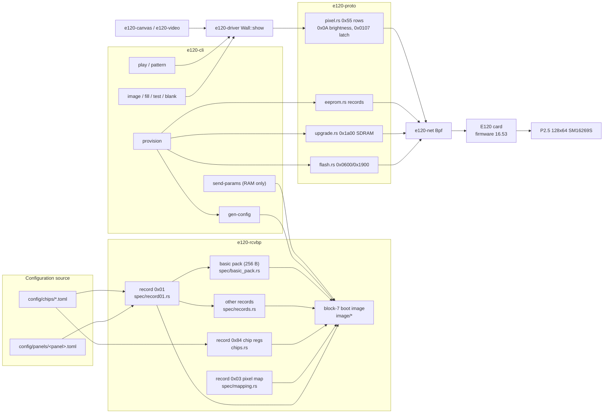

# Architecture

How a panel description becomes light, end to end, and which piece of the
repo owns each step. This is the map; the measurements behind every value
are in [rendering-recipe.md](rendering-recipe.md), the claims we withdrew in
[retracted-findings.md](retracted-findings.md), and the method in
[bench-measurement.md](bench-measurement.md).

## The pipeline

Two things reach the card over one raw Ethernet link (`en24`, `/dev/bpf`):

1. **Configuration**, once per card: a TOML panel spec is compiled into the
   receiver's boot image and written to flash block 7 together with firmware
   and the EEPROM control area (`e120 provision`). The card configures itself
   from flash at every power-on.
2. **Content**, every frame: brightness, 64 row packets, a gap, three latch
   frames (`e120 image` / `e120 play`).



### 1. Panel spec to boot image (`e120-rcvbp`)

Input is `config/panels/<panel>.toml` (`PanelSpec`, `spec/mod.rs`) plus the
chip library it names (`config/chips/*.toml`, `chips.rs`). No donor file is
read; every output byte is a vendor default, a spec field, a chip-library
value or a documented literal, and `Generated.provenance` names the source of
each placement ([building-a-config.md](building-a-config.md)).

| output | built by | from |
|---|---|---|
| record 0x01 (764 B) | `spec/record01.rs` | vendor Reset defaults, spec fields, chip-control block, then chip-library overrides, then `[record01_overrides]` last — this is where `+0x02F = 1` lands |
| record 0x03 pixel map | `spec/mapping.rs` | geometry + `[mapping]`: `line = row % scan`, `slot = (col/blk)·(groups·blk) + group·blk + col%blk`, `blk = mapping.block` |
| record 0x84 chip registers | `chips.rs::record_84` | library register order, reg 0x02 = scan−1 |
| remaining records | `spec/records.rs` | decoded loader defaults, vendor order; 0x84 inserted before 0xcd |
| `.rcvbp` container | `lib.rs` | 32-byte header, zlib record stream, CRC-32 trailer ([rcvbp-format.md](rcvbp-format.md)) |
| basic pack (256 B) | `spec/basic_pack.rs` | vendor `GetBasicParam` from record 0x01 + spec, body CRC |
| block-7 image (64 KB) | `image/mod.rs::Block7Builder` | region by region ([compiled-image-format.md](compiled-image-format.md)) |

Block-7 regions, in the order the builder must place them (later placements
win overlapping pages):

```
zero_regions → basic_pack @0x0000 → data_swap @0x0500 → module_positions @0x0600
→ anti_void @0x1800 → void_line_columns @0x1400 (iff mapping.gate_phantom_positions)
→ mapping @0x3000 → scan_table @0x6000 → [chip_registers @0x0900 iff boot.arm_at_boot]
→ rcvbp @0x8000
```

`void_line_columns` must run after `zero_regions` (which clears 0x1000–0x1800);
it is what turns black into LEDs-off ([black-floor.md](black-floor.md)). The
shared sequence lives in `Block7Builder::from_generated`; `gen_config` adds
the chip page and the embedded `.rcvbp` on top, and `send_params` slices the
same image into the vendor's 34 real-time RAM packs (`params.rs`).

Tests in `crates/e120-rcvbp/tests/factory.rs` pin all of this to reality: the
seller's shipped `.rcvbp` regenerates record for record, the factory basic
pack and block-7 image regenerate byte for byte from
`card-dumps/primary-region.bin`, and our spec differs from the seller's record
0x01 at exactly `[0x023, 0x02F, 0x0C0..0x0C3]`.

### 2. Card provisioning (`e120 provision`, `e120-cli/src/provision.rs`)

One command, dry-run without `--commit` ([provisioning.md](provisioning.md)):

| step | mechanism | protocol |
|---|---|---|
| snapshot | primary bank (blocks 0x00–0x0A) + golden bank (0x20) to `build/snapshot-<time>/` | `flash.rs read_flash` 0x0600 op 0x44 |
| firmware, path A | SDRAM self-program: stage the image in 1024-byte chunks (`upgrade::CHUNK`, 3 ms apart by default), erase, program, poll `programming_finished` | `upgrade.rs` 0x1a00 (`e120 upgrade install`) |
| firmware, path B | host page writes for blocks still differing after A (16.53 write-protects blocks 0–2 and 8 from this path, so A and B together make a whole bank) | `flash.rs erase_firmware_block / write_firmware_page`, `set_program_writable` 0x2300 (`e120 flash-firmware --from-block 3 --to-block 7`) |
| wait | 12 s after discovery reports the new version; earlier pushes are lost | `discovery.rs` 0x0700 |
| EEPROM read | the 256-byte record set via the linear read at 0x7F000 | `flash.rs read_flash_linear` 0x1900 |
| config | `gen-config` then `restore-flash` of the block-7 image (erase, 3 s settle, 256-byte pages 8 ms apart, verify, repair; page 0xF0 refusing is expected — it is the EEPROM mirror) | `flash.rs erase_block / write_page`, confined to `PARAM_BLOCK` 0x07 |
| EEPROM write | each record at its own address and length from `eeprom::RECORDS`, broadcast index, 500 ms apart; control area `(x, y, x+w, y+h)` from `--position`; save 0x87; reload 0x77; read back | `eeprom.rs` 0x1900 op 0x85 |

Flash allowlists in `e120-proto/src/flash.rs` make it impossible for the
parameter path to reach firmware or the golden bank. Writing block 7 wipes
the EEPROM mirror, which is why the record set is read before and rewritten
after. Power-cycle afterwards; the card arms from flash.

### 3. Frames (`e120-proto`, `e120-driver`, `e120-cli`)

Per refresh, in this order:

```
brightness (0x0A, 77 B)  →  one 0x55 row packet per panel row (64 × 128 px)
→  500 µs sleep  →  3 × latch/sync (0x0107, 112 B)
```

* `e120-proto/src/pixel.rs` builds the three frame kinds byte-exact against
  CLTNic.dll ([pixel-protocol.md](pixel-protocol.md)): `0x55` at offset 12,
  row / x-offset / count as BE u16 at 13/15/17, `08 88` at 19–20, pixels
  from 21, at most 497 per packet. It sequences nothing.
* `e120-driver::Wall::show` is the only content path (`play`, `pattern`,
  `image`, `fill`, `test`, `blank`): it renders an `e120-canvas::Canvas`
  (panels with position, rotation, flip, per receiver) into one framebuffer
  per receiver, cuts rows, chunks at 497, then applies `Timing` (latch gap,
  latch count, row gap; defaults are the measured recipe); `Pacer` keeps the
  fps. `e120-video` supplies frames (ffmpeg rawvideo pipe, test patterns).
  `e120-cli/src/display.rs::wall_settings` builds the `Settings` once, with
  the env-var overrides below.
* `e120-net::Bpf` is a dumb pipe: one `send` = one wire frame, `recv` returns
  within the timeout with whatever arrived, promiscuous so card replies to
  the vendor sender MAC are seen. No protocol knowledge lives there.

The card keeps only pixels whose screen coordinates fall inside its EEPROM
control area, so a multi-panel wall is many cards each provisioned with its
own `--position` and one `e120 play --layout wall.json` stream.

## Crate responsibilities

| crate | owns | must not |
|---|---|---|
| `e120-proto` | frame builders and reply parsers for every packet type; flash/EEPROM/firmware address allowlists | open sockets, sleep, sequence frames |
| `e120-net` | `/dev/bpf` open/send/recv on Darwin; classic pcap reader | know any Colorlight framing or MAC |
| `e120-rcvbp` | `.rcvbp` parse/write, record 0x01 view, chip library, spec → records/pack/boot image | touch the network or PSU |
| `e120-canvas` | RGB8 `Frame`, wall topology, canvas → per-receiver framebuffers | — |
| `e120-video` | `FrameSource`s: ffmpeg video, `Pattern`s | — |
| `e120-driver` | `Wall::show` (the measured frame recipe), `Pacer`, layout announce | — |
| `e120-cli` | the `e120` binary: clap tree, command modules, Block7 assembly order, still-image send path, flash discipline (dry-run/backup/verify), provisioning sequence | hold byte layouts (they belong in proto/rcvbp) |
| `scripts/` | the bench (`bench.py`, `psu.sh`) and read-only config inspection; EEPROM repair | build pixel frames |

## Measured defaults and where each lives

Everything below was found on the bench; the reasons are in
[rendering-recipe.md](rendering-recipe.md). Change them only with a
measurement.

| default | value | lives in | pinned by |
|---|---|---|---|
| chip id | `0x14C` | `config/chips/sm16269s-factory.toml` via `[chip] library` | `factory.rs` record 0x84 equality |
| `+0x02F` | 1 | `config/panels/…toml [record01_overrides]`, applied last in `spec/record01.rs` | `factory.rs` delta list `[0x023, 0x02F, 0x0C0..]` |
| grey depth | 12 (12–16 render alike) | `[module] gray_bits` | same delta list (`0x023`) |
| mapping block | 64 | `[mapping] block` | `the_sellers_mapping_is_reproduced_by_the_block_knob` |
| phantom-position gate | on | `[mapping] gate_phantom_positions` default true, `spec/mod.rs`; `Block7Builder::void_line_columns` | bench current only (black 0.466 A) |
| arm at boot | true | `[boot] arm_at_boot` → chip page 0x0900 | — |
| frame order | brightness → rows → 500 µs → 3 latches | `e120-driver/src/lib.rs` `Timing::default()`; `display.rs::wall_settings` reads the env overrides | `settings_default_to_the_measured_recipe`, eye on the bench |
| raster | `rows` | the only layout `Wall::show` cuts (one 0x55 packet per panel row) | — |
| layout announce | off | `Settings::default()` and `display.rs::wall_settings` (the frame blanks a provisioned card) | `settings_default_to_the_measured_recipe` |
| colour order | `bgr` | `main.rs` `--order` default; driver `Settings` | `colour_order_reorders_the_channels` |
| pixels per packet | 497 | `e120-proto/src/pixel.rs MAX_PIXELS_PER_PACKET` | `pixel_rows_follow_the_fpp_layout` |
| firmware | 16.53, installed via SDRAM + host blocks 3–7 | `third-party/firmware/…16.53…hex`, `provision.rs::install_firmware` | `e120 discover` reports it |
| EEPROM control area | `(0,0,128,64)` | `--position`, `eeprom::control_area` | `scripts/flash-review.py` |
| brightness ceiling | ≤ 40 until content is right | operator rule (HANDOFF.md) | PSU current |

Experiment-only overrides (defaults above are the contract; nothing in
`scripts/` sets them): `E120_LATCHES`, `E120_LATCH_GAP_US`, `E120_ROW_GAP_US`,
`E120_FRAME_MS` (`display.rs`, read once into `e120_driver::Timing`).

## Bench tooling

| tool | use it when |
|---|---|
| `scripts/psu.sh on/off/status/extend` | every power action. Arms a 10-minute auto-off; never writes voltage or current. |
| `scripts/bench.py boot` | before any configuration experiment: power-cycle, wait for discovery, settle 12 s, `send-params`. |
| `scripts/bench.py run` | every A/B: one looping 30 fps stream of all conditions plus a same-content control, primed-average camera captures at 30 % into each segment, PSU current per condition. `--restart` streams each condition through `e120 image --hold` for per-condition flags. |
| `scripts/bench.py locate / capture / compare / tile` | set the crop once per rig, take a single averaged photo, diff two, tile a set. Captures must stay primed averages: the panel is 1/16 multiplexed and a single frame is scan phase, not content. |
| `scripts/flash-review.py <dump>` | after every flash operation: diff block 7 against the day-one dump run by run, and check the EEPROM control area is not `0xFFFF`. |
| `scripts/eeprom-restore.py` | the control area or another EEPROM record is erased and you do not want to re-provision: rewrites records from the day-one dump one at a time (`--commit`). `e120 provision` does the same natively. |
| `scripts/mapdump.py / mapstruct.py / chipregs.py` | compare two `.rcvbp` files as geometry (record 0x03) or as register tables (0x84); read-only. |
| `e120 discover / listen / raw-send / replay / pcap-summary` | wire diagnostics; `discover` is also the firmware-version check. |

## Where to change what

| I want to… | edit | then |
|---|---|---|
| describe a new panel or wall | `config/panels/<panel>.toml` (copy the existing one) | `e120 gen-config`, `e120 provision --commit`, power-cycle |
| add a driver chip | `config/chips/<chip>.toml`; `chips.rs` only if it needs a new block shape | `factory.rs` still passes |
| change the pixel wiring | `[mapping]` in the spec; formula in `rcvbp/src/spec/mapping.rs` | `restore-flash` + power-cycle (mapping is read from flash at boot) |
| change a record 0x01 byte | `[record01_overrides]` in the spec, or `spec/record01.rs` DEFAULTS if it is a vendor default | update the delta test in `factory.rs` |
| change a boot-image region | `rcvbp/src/image/*`; the order lives in `Block7Builder::from_generated` | `the_factory_image_rebuilds_from_erased_flash…`, `the_bench_spec_displaces_the_phantom_positions` |
| change the wire format of a frame | `proto/src/pixel.rs` (rows/latch/brightness) or the matching proto module | the byte-pinned proto tests |
| change frame timing or latch count | `driver/src/lib.rs` `Timing::default()` (and the matching defaults in `cli/src/display.rs::wall_settings`) | `bench.py run`, judge by eye, update rendering-recipe.md |
| add a content source or pattern | `e120-video` | `e120 pattern` / `play` |
| add a wall layout feature (rotation, flip) | `e120-canvas` | canvas unit tests; layout JSON is the on-disk format |
| add a flash or EEPROM operation | builder + allowlist in `e120-proto`, command in `e120-cli`; dry-run without `--commit` | `flash-review.py` after |
| change how the card is found or replies are read | `e120-net` (transport) or `proto/discovery.rs` (parsing) | `e120 discover` |
| run an experiment | `bench.py run` with the env overrides above, never by editing a default | record the result in rendering-recipe.md or retracted-findings.md |
